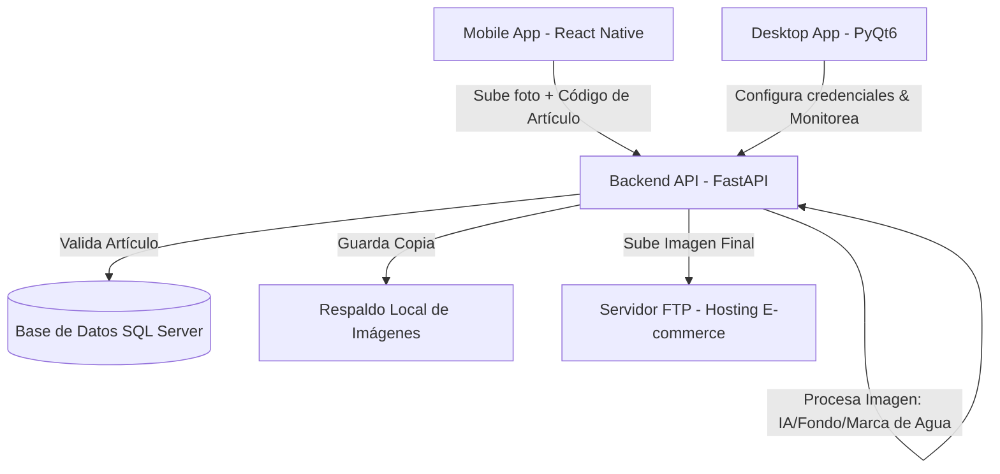

# Ecommerce Photo Publisher & Management System

Este repositorio contiene un sistema completo y coordinado para capturar, procesar y publicar fotos de productos orientadas a plataformas de e-commerce. La solución está dividida en tres componentes principales:

1. **Backend (`Backend/`)**: API REST desarrollada en FastAPI encargada de recibir las imágenes, realizar procesamiento digital (eliminación de fondo, aplicación de marcas de agua/sellos), guardar respaldos locales y subir los archivos finales a servidores FTP remotos, validando previamente los códigos de artículo contra una base de datos Microsoft SQL Server.
2. **Mobile (`Mobile/`)**: Aplicación móvil híbrida construida con React Native y Expo que permite a los operadores tomar fotografías directamente con la cámara del dispositivo, validar el código del producto y subirlas al servidor de forma ágil.
3. **App Desktop (`appdesktop/`)**: Aplicación de escritorio desarrollada con PyQt6 que actúa como un cliente de administración, permitiendo gestionar de manera visual el flujo de publicación de imágenes, monitorear logs y configurar las credenciales de FTP y SQL Server.

---

## Arquitectura del Sistema

---

## Requisitos Previos Generales

- **Python 3.10 o superior** (para el Backend y la App Desktop)
- **Node.js LTS** (para la App Mobile)
- **Base de Datos Microsoft SQL Server** activa
- **Servidor FTP** configurado y accesible

---

## Estructura del Repositorio

- **`/Backend`**: Servidor API REST con Python, FastAPI, Pillow (procesamiento de imágenes) y pyodbc (conexión SQL).
- **`/Mobile`**: Aplicación de frontend móvil en Expo.
- **`/appdesktop`**: Interfaz de escritorio multiplataforma utilizando Python y PyQt6.

Para las guías detalladas de instalación, configuración y ejecución de cada componente, por favor consulte los READMEs específicos:

* [README de Backend](file:///c:/Program%20Files%20%28x86%29/Cimer%20Fotos%20App/Backend/README.md)
* [README de Mobile](file:///c:/Program%20Files%20%28x86%29/Cimer%20Fotos%20App/Mobile/README.md)
* [README de App Desktop](file:///c:/Program%20Files%20%28x86%29/Cimer%20Fotos%20App/appdesktop/README.md)
